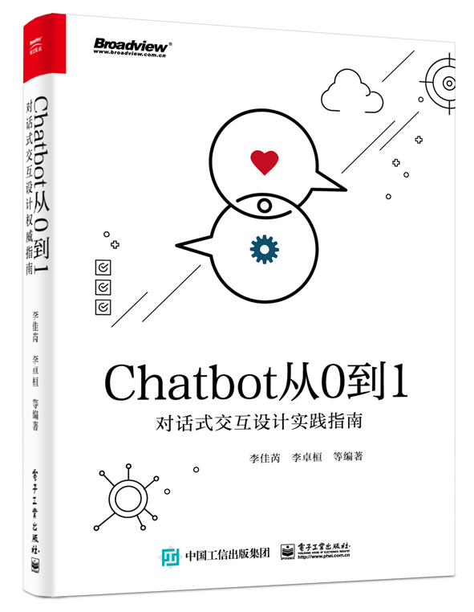
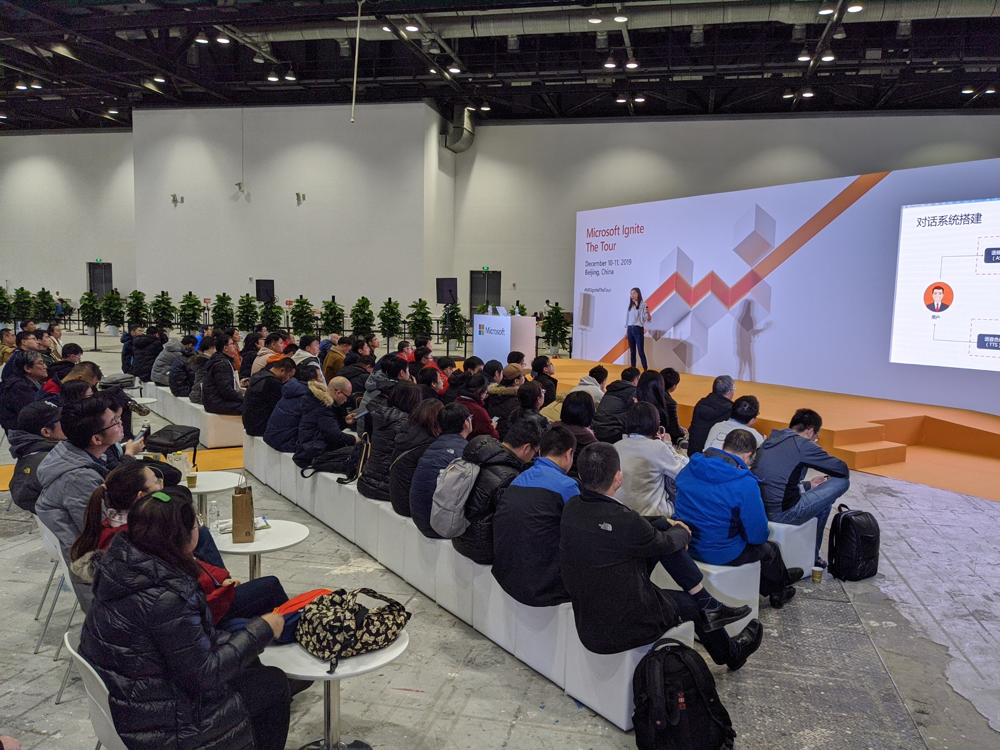

# Chatbot Zero to ONE

## 简介

**购买链接：** [Chatbot从0到1：对话式交互设计实践指南](https://item.jd.com/12630213.html)
**第二版介绍：** [Chatbot从0到1：手把手落地大模型应用](https://juzibot.com/chatbot/practice-guide)

《Chatbot从0到1：对话式交互设计实践指南》内容共5部分。第1部分从人工智能的发展带动对话式交互引出Chatbot的应用场景及其分类；第2部分和第3部分从需求分析、流程设计、数据处理、对话脚本撰写、系统搭建、对话任务测评、平台渠道集成、运营反馈等方面，对Chatbot的整个生命周期进行了详细分析和介绍；第4部分通过案例分析，对Chatbot进行了实践；第5部分总结了目前对话式交互的局限性，并展望了基于人工智能发展Chatbot的机会。

《Chatbot从0到1：对话式交互设计实践指南》适合希望从事Chatbot行业的读者阅读，尤其是正在考虑将业务切入 Chatbot领域的决策者，即将或正在从事Chatbot专业工作的产品经理和项目经理，以及希望了解Chatbot领域工作流程的开发人员。



### 作者互动交流群

扫码加我微信，加入Chatbot 从 0 到 1 动手实验群，与作者互动~


## English Introduction

《Chatbot Zero to One: Practice Guide to Conversational Interaction Design》contains 5 parts.

- Part 1 talks about Chatbot scenarios and its classification from the development of artificial intelligence to promote an interactive dialogue perspective.
- Part 2 and Part 3  introduce the entire Chatbot lifecycle: requirements analysis, process design, data processing, scriptwriting, system construction, dialog task evaluation, IM channel integration, operational feedback.
- Part 4 shows Chatbot practical operation case based on the Chatbot lifecycle.
- Part 5 summarizes the limitations of the current dialogue interaction and looks forward to the Chatbot future as well as the opportunity to develop Chatbot based on artificial intelligence.

《Chatbot Zero to One: Practice Guide to Conversational Interaction Design》 is suitable to readers who want to work in the Chatbot industry, especially for decision-makers who are considering entering the business in the Chatbot field, product managers and project managers who are about to be engaged in the professional work of Chatbot, and developers who want to understand the workflow in the Chatbot field.

## Microsoft Ignite the Tour 2019 Beijing

虽然 Chatbot 已经成为互联网业界和该投资领域的热点之一，也在或深或浅的融入和影响着大家的生活，但是开发一个 Chatbot 门槛依然非常高。我们希望可以让熟悉业务流程的人，不需要任何数学能力、算法能力、软件能力和工程能力，也能搭建符合企业业务流程的 Chatbot。为了解决这个问题，我们根据即将出版的书籍《Chatbot 从 0 到 1》，围绕对话系统的生命周周期，讲述如何利用微软的 Congnitive Service 搭建聊天机器人并提供实战练习。



[Ignite Tour Slides - 基于微信生态，如何从0到1搭建聊天机器人](https://docs.google.com/presentation/d/1NUHIyrYyhYuUrfNm2E7D7GtMjfX2Y6EoiNwXhE33iPU/edit#slide=id.g4abc7fef5d_0_420)

## How To Run

```shell
git clone git@github.com:lijiarui/chatbot-zero-to-one.git
cd chatbot-zero-to-one
npm install
npm start
```

## Authors

- [Rui](https://github.com/lijiarui),[(李佳芮)](https://lijiarui.github.io) Co-author of [Wechaty](https://github.com/wechaty/wechaty), Founder of [JuziBot](https://www.botorange.com/), Microsoft AI MVP
- [Huan](https://github.com/huan) [(李卓桓)](http://linkedin.com/in/zixia) Tencent TVP of Chatbot, Microsoft Regional Director, <zixia@zixia.net>
